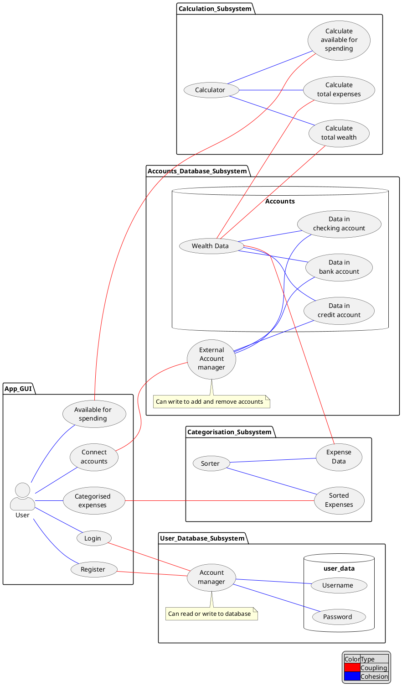

[[50.003 Elements of Software Construction|50.003]]

# Cassie Chong C4G4 1005301 Cohort exercise 1
## (10 points) Question 1:

In his 2000 Turing lecture ‘The Design of Design’, Frederick Brooks said, ‘The Waterfall Model is Dead Wrong’. I suppose you would agree to certain extent. The waterfall model assumes that the different stages of software development are sequential. Discuss with your group on the actual relationship between the 5 activities in SDLC + the stage of maintenance.
***
The activities are not sequential. At any point in time, Requirements can change. This can be due to new client requirements, user requirements, or even secondary requirements that arise from problems faced during the other activities.

Client requirements may update over time, they may suddenly want another feature implemented, for example. User requirements may also change, they may need support for a new Android version if it is newly released, for example. Secondary requirements may arise that the programmer did not expect initially, for example, while doing Implementation, the programmer finds that it is more convenient to use a certain other language or add another feature that can improve user experience. Hence, the activity Requirements can begin at any time.

Analysis should be done every time Requirements change. This is to develop the best workflow and evaluate the Requirements. Design follows, followed by Implementation.

Testing is another activity that can be done at any point in time. All activities can be tested, in terms of the product’s logic, workflow, etc. Hence Testing is another overarching activity that is not in sequence.

Maintenance is started after the product is out, after Implementation. If problems arise, it may result in a change in Requirements. Then the process that follows will continue as per usual (Analysis, Design, Implementation, Test throughout).

## (10 points) Question 2:

- Assume you are designing a personal budget planning application
	- It connects your **checking**, **credit** and **savings** accounts and **detects** recurring bills, stocks, and income.
	- Then it shows how much is **available** for everyday spending by **subtracting** upcoming bills, savings goal contributions and pre-budgeted money from your estimated income.
	- It automatically **categorizes** your expenses, but you can also create custom categories and set limits for them.
- _Decompose the application into (at least) four subsystems. Label the Coupling and Cohesion edges to show interaction._

***


## (10 points) Question 3:

A railway network consists of several tracks, junction points and trains.

- A train moves along the track until it requires to change the track to reach destination. The changes of track occur only through a junction point.
-  Each train is initially positioned at a junction point and its destination is a different junction point. Hence, while a train approaches its destination junction point, it does not need to change tracks any more.
- Each track can have at most one train at a time to avoid collision, but all tracks in the railway network are bi-directional.


Design a set of interfaces (e.g. Java interface) for a safe (i.e. collision free) system. No coding is required, the interfaces (i.e. member variables and implementable functions) and their purpose will suffice.
***
Train should have an identifier so the other parts know what state the train is in. Train must follow track. It will only be allowed a choice to change only when it reaches a junction. Keep data of path travelled so train gets somewhere (avoid cycles and be able to recover from deadends). Keep data of current track to be sent to other trains so they don't collide.
Methods check for other trains and find available tracks to visit. Also checks junction and destination.
```java
interface Train {
	id;
	destination;
	nextJunction;
	pathTravelled;
	currentTrack;
	isTrackOccupied;

	isAtDestination();

	getTrainId();
	setTrainId();
	getDestination();
	setDestination();
	getNextJunction();
	setNextJunction();
	getPathTravelled();
	setPathTravelled();
	getCurrentTrack();
	setCurrentTrack();

	move();
}
```
Track must have unique identifier for trains to record. It will hold train's id if a train is on the track.
```java
interface Track {
	id;
	trainId;
	occupied;

	isTrackOccupied();
	setTrackOccupied();
}
```
Junction point must have an identifier so that trains know where to travel and where they are. Junction Point must know which state it is in (which two tracks are connecting to it). State is concatenation of Track id, where order doesn't matter. It will have a method to change this state. It must receive data from the track if there is an incoming train and receive data from train if train's implementation of move() wants to go to a particular track.
```java
interface JunctionPoint {
	id;
	trackId;
	trainId;
	state;

	getState();
	setState();
	getTrackId();
	getTrainId();
}
```

## (10 points) Question 4:
- Consider the railway network from previous exercise. Assume tracks of different type – broad gauge, meter gauge and narrow gauge. Each junction point is further divided into individual establishments that exclusively handle a specific track (i.e. meter, broad or narrow). Similarly, trains for meter gauge track is different from trains for broad gauge and narrow gauge. Narrow gauge trains are not powerful to run longer than the distance between two junction points. At each junction point, therefore, its engine is changed.
-  Refine your set of interfaces to capture this system.
***
Other than id, train must have data of its own type. The type must be accessible to junction points.
```java
interface Train {
	id;
	trainType;
	destination;
	nextJunction;
	pathTravelled;
	currentTrack;
	isTrackOccupied;

	isAtDestination();

	getTrainId();
	setTrainId();
	getTrainType();
	setTrainType();
	getDestination();
	setDestination();
	getNextJunction();
	setNextJunction();
	getPathTravelled();
	setPathTravelled();
	getCurrentTrack();
	setCurrentTrack();

	move();
}
```
Track now has types. Junction point must know what track type it is to handle them differently. If there is a train, it must know the type too.
```java
interface Track {
	id;
	trackType;
	trainId;
	trainType;
	occupied;

	isTrackOccupied();

	getTrackType();
	setTrackType();
	getTrainType();
	setTrackOccupied();
}
```
Junction point must know what track type it is as it must handle different tracks with different establishments. It must also know the train type as it has to change the train engine for narrow gauge trains every time one arrives.
```java
interface JunctionPoint {
	id;
	trackId;
	trackType;
	trainId;
	trainType;
	state;

	getState();
	setState();
	getTrackId();
	getTrackType();
	getTrainId();
	getTrainType();

	changeEngine() {
		if (this.getTrainType() == "narrow") {
			changeEngine
			this.getTrainId().move();
		}
	}
}
```


## (10 points) Question 5:
Your project needs to be completed in **3 months**. The estimated size of the system you are developing is **20,000** LOC.
1. Find out how much effort your team will need (assume **productivity = 1200**, i.e., Scientific software).
2. The team members decide to take a break during recess week (0.25 month). Is it wise
3. Amongst the following choices, select the measure(s) you feel are most appropriate for your team to meet the original deadline _and_ have the planned break.
4. Add two new members to the team immediately? ;)
5. Every member of the team work longer hours each day?
6. Re-estimate the size of the system to be lower than 20,000 LOC?

**Answer in a report. Do not just copy the provided sample answer, answer with your own thinking, and explanation as detailed as possible.**
### 1
Let units of $Time$ be months.
$$
\begin{align}
Effort &= \left[\dfrac{Size}{Productivity \times Time^{4/3}}\right]^3 \times B\\
&= \left[\dfrac{20 000}{1200 \times 3^{4/3}}\right]^3 \times 0.18\\
&\approx 10.288
\end{align}
$$
### 2
Time now reduced to 2.75 months.
$$
\begin{align}
Effort &= \left[\dfrac{Size}{Productivity \times Time^{4/3}}\right]^3 \times B\\
&= \left[\dfrac{20 000}{1200 \times 2.75^{4/3}}\right]^3 \times 0.18\\
&\approx 14.57095371
\end{align}
$$
A lot more effort is needed. May not be worth it.

### 3
Reduce Size.
The Size metric is cubed, and then multiplied with a B factor that depends on Size. The influence of Size on the Effort needed is huge, arguably most important among all the factors. The way to do this is to design the project well and efficiently.

### 4
Let original number of members be $x$, then adding 2 will have $x+2$. It takes $Effort \approx 10.288$ for $x$ members. It will take 1 member $10.288x$. So
$x+2$ members will take $Effort \approx \dfrac{10.288x}{x+2}$.

### 5
If longer hours are worked, Time remain the same as 3 months, lower effort can be afforded.

### 6
If size reduced, Size and B reduced, so Effort is reduced.
$$
\begin{align}
Effort &= \left[\dfrac{Size}{Productivity \times Time^{4/3}}\right]^3 \times B\\
&< \left[\dfrac{20 000}{1200 \times 3^{4/3}}\right]^3 \times 0.18\\
&< 10.288
\end{align}
$$
