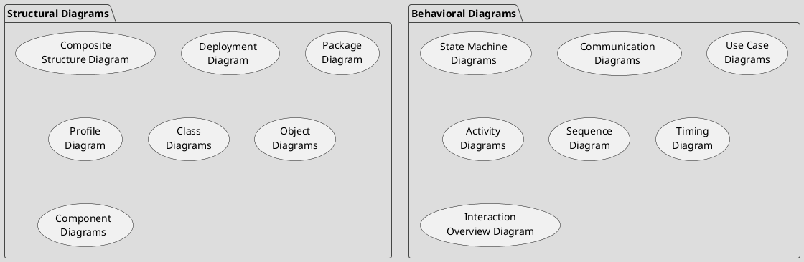

[[50.003 Elements of Software Construction|50.003]]
[[Languages of software development]]

## Unified Modelling Language
UML is extensible.
There are 14 UML diagram types.

## We wil cover
[[Use Case Diagram]]
[[Sequence Diagram]]
[[Class Diagram]]
[[State Diagram]]

