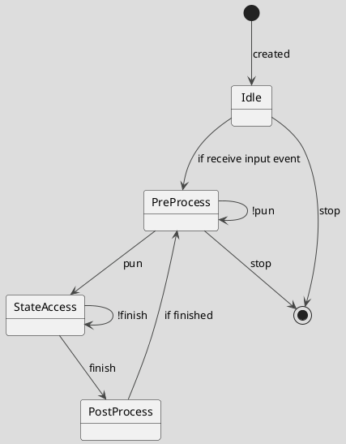

[[50.003 Elements of Software Construction|50.003]]

## 2 Case studies
- [[#MorphStream]]
- [[#SentiStream]]

### MorphStream
https://github.com/intellistream/MorphStream
Data Stream Processing System (DSPS) is a data processing system that can process, store, analyze, and act upon a continuous, unlimited real-time data flow from various sources.
![[Pasted image 20220606111202.png]]
- This project aims at building a scalable transactional stream processing engine on modern hardware.
	- It allows ACID transactions to be run directly on streaming data.
- It shares similar project vision with Flink StreamingLedger from Data Artisans (https://www.ververica.com/hubfs/Ververica/Docs/%5B2018-08%5D-dA-Streaming-Ledger-whitepaper.pdf), but MorphStream emphsizes more on improving system performance leveraging modern multicore processors
![[Pasted image 20220606111253.png]]
![[Pasted image 20220606111449.png]]
![[Pasted image 20220606111459.png]]
![[Pasted image 20220606111506.png]]
![[Pasted image 20220606111519.png]]
![[Pasted image 20220606111526.png]]
![[Pasted image 20220606111533.png]]
![[Pasted image 20220606111542.png]]
![[Pasted image 20220606111548.png]]

### SentiStream
## [[Multithreading]] programming
For addressing performance requirements